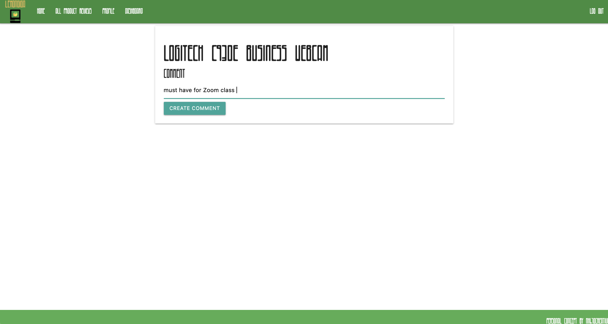

# LEMONGIGA


## OVERVIEW

The app is currently deployed on [MS Azure](http://lemongiga.azurewebsites.net//).

This a is Django Python app using a Postgres SQL database. The core functionality will allow the admin user to create tech/gadget reviews - name, description, star rating, price, and high-res product pack shot. Non-administrations can add, edit, and delete comments on each of the reviews. The relational database utilizes Many-to-Many relationships.





### USER STORIES
- As a user, I want to be able to navigate to "/" and see a basic splash page with:
    - The name of the website.
    - Links to "Log In" and "Sign Up".
- As a user, I want to be able to sign up for an account.
- As a user, I want to be able to log in to my account if I already have one.
- As a user, I want to be redirected to their public profile page after logging in.
- As a user, I want to see my user name and join date on their public profile page.
- As a user, I want to see the site-wide header on every page with:
    - A link to "Log Out" if I'm logged in.
    - Links to "Log In" and "Sign Up" if I'm logged out.
- As a user, I want to be able to update my profile.
- As an admin user, I want be able to add a review to the site through the admin panel.
- As a user, I want to see a "default" profile photo on my profile page before adding my own photo.
- As a user, I want to be able to update my profile photo.
- As a user, I want to see my profile photo next to my posts.

#### INSTALLATION - FOR LOCAL HOSTING
1. Please read the below list of required modules and verify if they are installed.
  - Use NPM to install missing modules. 
2. Create an `.env' file and activate it.
3. Create a database: ```createdb lemongiga```
4. Make migration config files: ```python3 manage.py makemigrations```
5. Import the migration config files to the database: ```python3 manage.py migrate```
6. Initialize the server: ```python3 manage.py runserver```
7. Open a browser window and access local server URL: ```localhost:8000```

#### LIST OF REQUIRED TECH
* Django 3.1.7
* Pillow 8.1.2
* Psycopg2 2.8.6
* Pytz 2021.1
* Sqlparse 0.4.1
* Whitenoise 5.2.0

#### ERD

